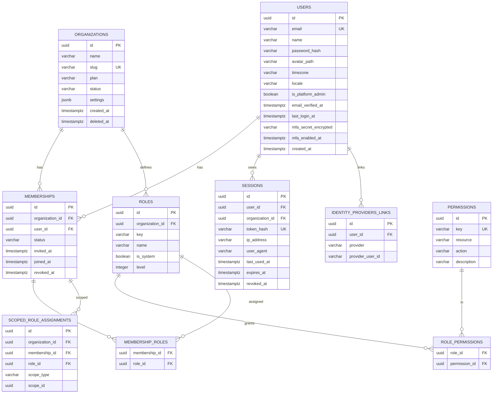
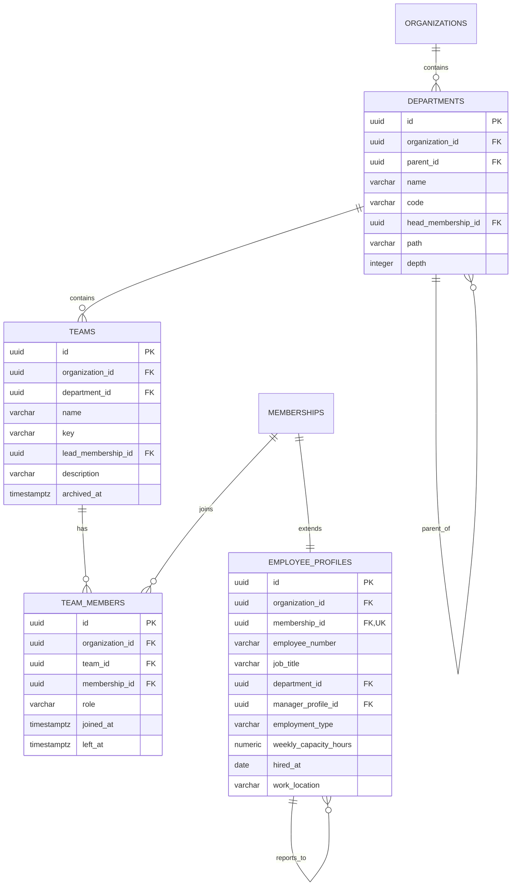
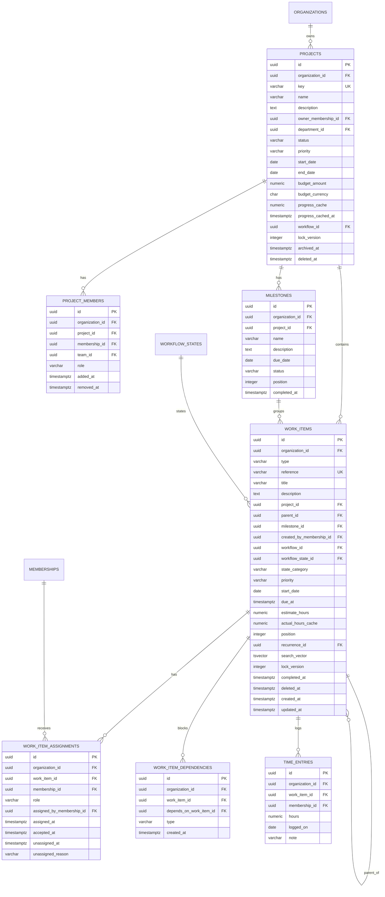
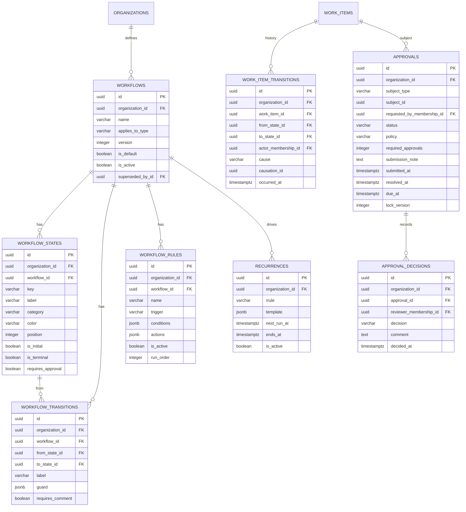
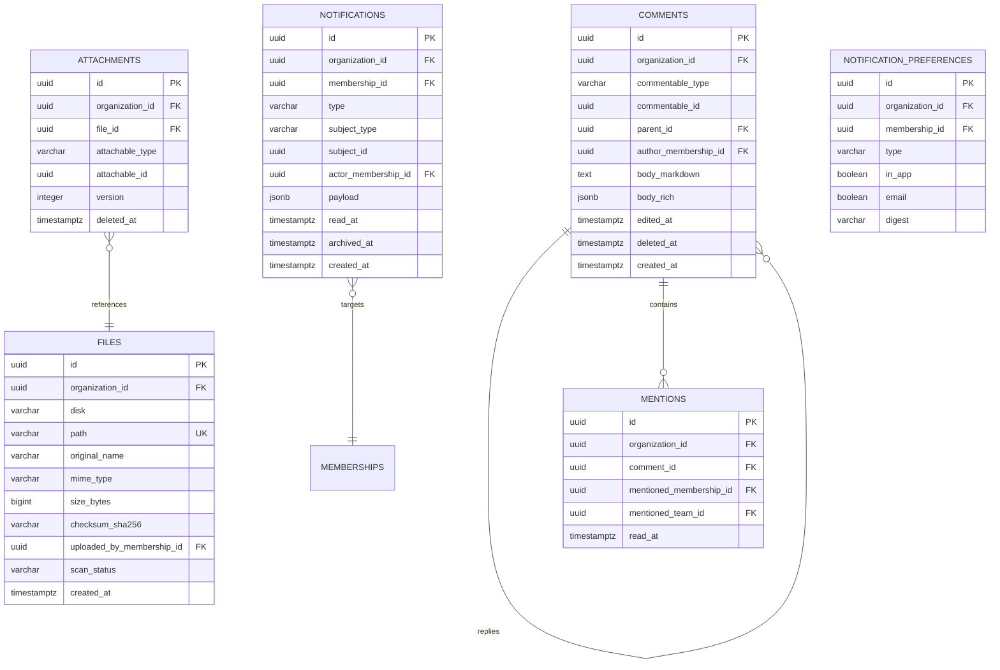
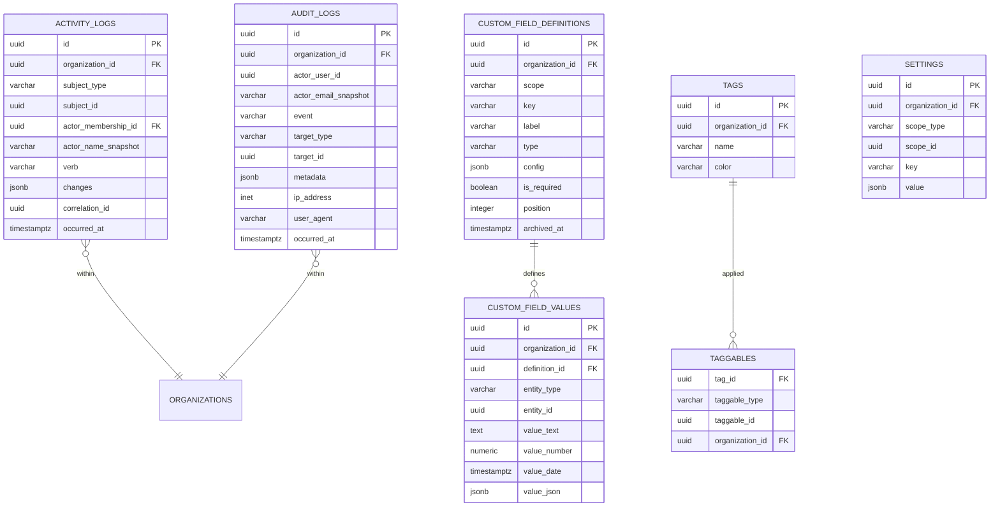

# 03 — Database Schema & ERD

> PostgreSQL 17. The schema reflects the domain model (`02`), not the UI.

---

## 0. Conventions

| Rule | Decision |
|---|---|
| Primary keys | `uuid` (v7, time-ordered). Not auto-increment: IDs appear in URLs and would leak org size and creation order; v7 keeps B-tree locality that random v4 destroys. |
| Naming | `snake_case`, plural tables, `{singular}_id` FKs. |
| Timestamps | `timestamptz` always. Server stores UTC; presentation converts. |
| Tenant column | `organization_id uuid NOT NULL` on every tenant-scoped table, first column after `id`. |
| Soft delete | `deleted_at timestamptz NULL` only where restore is a real user need (work items, projects, comments, attachments). Not on logs, not on join tables, not on approvals. |
| Concurrency | `lock_version integer NOT NULL DEFAULT 0` on `work_items`, `projects`, `approvals` — optimistic locking; a stale write returns HTTP 409, not a silent overwrite. |
| Enum-ish columns | `varchar` + `CHECK` constraint, not Postgres `ENUM` types. Adding a value to a PG enum inside a transaction is painful; a CHECK is a one-line migration. |
| Money | `numeric(15,2)` + separate `currency char(3)`. Never floats. |
| JSON | `jsonb` only for genuinely schemaless config (rule conditions, field config, notification payloads). Never for queryable business data. |
| Deletion of people | Users are **never** hard-deleted. Membership is revoked, the user is deactivated, history is preserved. |

**Every foreign key that crosses into another table also carries the tenant
check.** Composite FKs on `(organization_id, id)` are used on the high-risk
relationships (work item → project, work item → parent, assignment → work item)
so the *database itself* refuses a cross-tenant reference. This costs a
composite unique index per parent table and is worth it.

---

## 1. Identity & Access



Notes:

- **`users` is global; `memberships` is the tenant join.** A user can belong to
  several organizations — required for SaaS, and free to build now.
- `permissions` is a **global catalogue** (`work_item.assign`, `project.create`)
  seeded by migration, not per-tenant. Roles are per-tenant so a customer can
  rename or compose them.
- `scoped_role_assignments` is the seed of granular permissions: "Manager **of
  project X**", "Lead **of team Y**". At MVP only org-wide roles and project
  membership roles are used; the table exists so Phase 7 needs no migration of
  live permission data.
- Unique indexes: `memberships (organization_id, user_id)`,
  `roles (organization_id, key)`.

---

## 2. Organization structure



- `departments.path` is a **materialized path** (`/root-id/child-id/`) with a
  `depth` column. Reading "everything under Engineering" is then a single
  `LIKE '/eng-id/%'` index scan instead of a recursive CTE on every dashboard
  load. The write cost (rewriting descendants on a move) is rare; the read
  benefit is on every page. `ltree` was considered — materialized path is chosen
  for portability and because Eloquent handles it without an extension.
- `employee_profiles.manager_profile_id` is the reporting line, separate from
  department headship. Cycle check on write.
- `weekly_capacity_hours` is what makes the workload calculation in `02` §11 real.

---

## 3. Work — the core



### Key columns explained

- **`type`** — `task | request | approval_work | incident | review | campaign |
  operational`. CHECK-constrained. This is the polymorphism from `02` §2.
- **`reference`** — human-readable ID (`ENG-142`). Unique per organization,
  generated from the project key or an org-wide sequence. Users say "ENG-142" in
  Slack; a UUID is unusable for that.
- **`state_category`** — *denormalised* from `workflow_states.category`. It is
  duplicated on purpose: every list query, dashboard count, and overdue check
  filters on category, and joining `workflow_states` for all of them is a
  measurable cost. Kept in sync inside the same transaction as the state change,
  with a consistency check in the test suite.
- **`due_at` is `timestamptz`, `start_date` is `date`.** Deadlines have a time
  ("Friday 17:00"); start dates in practice do not. Mixing these types is a
  common source of off-by-one-day timezone bugs.
- **`actual_hours_cache`** — derived from `time_entries`, refreshed by job.
  Never authoritative.
- **`position`** — fractional ordering (`numeric`) for board drag-and-drop, so
  reordering one card writes one row instead of renumbering the column.
- **`search_vector`** — maintained `tsvector` over title + description, GIN
  indexed. Postgres FTS from day one, per `01` §10.

### Indexes on `work_items` (the table that decides whether the app is fast)

```sql
-- the single most important index: "my work", scoped and sorted
CREATE INDEX idx_wi_org_state_due
  ON work_items (organization_id, state_category, due_at)
  WHERE deleted_at IS NULL;

CREATE INDEX idx_wi_org_project_position
  ON work_items (organization_id, project_id, position)
  WHERE deleted_at IS NULL;

CREATE INDEX idx_wi_parent    ON work_items (parent_id) WHERE deleted_at IS NULL;
CREATE INDEX idx_wi_milestone ON work_items (milestone_id);
CREATE INDEX idx_wi_type      ON work_items (organization_id, type);
CREATE INDEX idx_wi_search    ON work_items USING GIN (search_vector);
CREATE UNIQUE INDEX uq_wi_reference ON work_items (organization_id, reference);

-- composite target for tenant-safe FKs from child tables
CREATE UNIQUE INDEX uq_wi_org_id ON work_items (organization_id, id);

-- "what is currently on my plate" — the hottest join in the product
CREATE INDEX idx_wia_active
  ON work_item_assignments (organization_id, membership_id, role)
  WHERE unassigned_at IS NULL;

-- at most one active primary assignee per item
CREATE UNIQUE INDEX uq_wia_one_active_assignee
  ON work_item_assignments (work_item_id)
  WHERE unassigned_at IS NULL AND role = 'assignee' AND is_primary;
```

Dependency integrity: `CHECK (work_item_id <> depends_on_work_item_id)`, unique
on the pair, and cycle detection in the application via a recursive CTE before
insert (Postgres cannot express "acyclic" as a constraint).

---

## 4. Workflow & Approvals



- `work_item_transitions` is the **state history**, separate from the activity
  log because it is structured data that cycle-time analytics query directly.
  `causation_id` links a transition to the rule execution that caused it —
  this is what makes automated changes debuggable.
- `approvals.policy` — `any_one | all_of | quorum`. `required_approvals`
  supports the quorum case. Multi-approver is modelled now even though the MVP
  UI only exposes single-reviewer, because retrofitting it means migrating live
  approval records.
- Partial unique index: one `pending` approval per subject.
- `recurrences.rrule` uses the RFC 5545 string — a solved problem, do not invent
  a scheduling DSL.

---

## 5. Collaboration, Files, Notifications



- **`files` and `attachments` are separate.** A file is a stored blob with a
  checksum; an attachment is a link from a subject to that file. Same file
  attached to two work items = one blob. Deduplication by checksum is then
  trivial, and versioning an attachment (`version`) does not duplicate storage.
- Binary content is **never** in the database; only the `disk` + `path`
  reference (`01`, `05`).
- `scan_status` — `pending | clean | infected | skipped`. Downloads of a
  non-clean file are refused. Uploads are quarantined until scanned.
- `notifications.payload` holds a **rendered-safe snapshot** (actor name, subject
  title at the time) so a notification list renders without N joins and still
  reads correctly after the subject is renamed or deleted.
- Notification writes are batched from a queued job; a comment mentioning 20
  people must not write 20 rows inside the user's request.

---

## 6. Governance & extensibility



- Both log tables are protected by a `BEFORE UPDATE OR DELETE` trigger that
  raises an exception. Append-only is a database guarantee, not a code habit.
- Both are **partitioned by month** (`RANGE` on `occurred_at`) from the first
  migration. Retrofitting partitioning onto a 200-million-row table is a
  maintenance window nobody wants; doing it upfront costs one migration.
- `activity_logs.changes` stores `{field: {from, to}}` — enough to render the
  timeline without re-deriving anything.
- `correlation_id` ties every row produced by one user action together, so the
  UI can collapse "changed 4 fields" into one timeline entry.
- `settings` is hierarchical: organization → department → project → user, with
  the resolver taking the most specific value present.

---

## 7. Full table inventory

```text
IDENTITY     users · sessions · memberships · roles · permissions
             role_permissions · membership_roles · scoped_role_assignments
             identity_provider_links · password_reset_tokens · invitations

ORGANIZATION organizations · departments · teams · team_members
             employee_profiles · time_off (Phase 6+)

WORK         projects · project_members · milestones
             work_items · work_item_assignments · work_item_dependencies
             work_item_watchers · time_entries · saved_views

WORKFLOW     workflows · workflow_states · workflow_transitions
             workflow_rules · workflow_rule_runs · work_item_transitions
             approvals · approval_decisions · recurrences

COLLAB       comments · mentions · reactions
             files · attachments
             notifications · notification_preferences

GOVERNANCE   activity_logs · audit_logs · settings
             custom_field_definitions · custom_field_values
             tags · taggables

PLATFORM     jobs · failed_jobs · job_batches · cache · schedule_locks
```

`saved_views` deserves a note: user- or org-owned stored filter+grouping+sort
definitions. It is what turns a rigid page into a workspace, it is cheap, and
building filters without it means every filter combination becomes a hardcoded
page.

---

## 8. Data integrity rules summary

1. **Every multi-step write is inside a transaction.** Assignment + activity +
   event recording either all happen or none do.
2. **FKs are declared with explicit `ON DELETE` behaviour**, chosen per relation:
   `RESTRICT` for anything with history (never lose an audit trail to a cascade),
   `CASCADE` only for pure children (custom field values, taggables).
3. **Optimistic locking** on `work_items`, `projects`, `approvals`. Two managers
   editing the same task get a 409 and a merge prompt, not a lost update.
4. **Check constraints carry real rules**: `start_date <= due_at`,
   `estimate_hours >= 0`, `type IN (...)`, `state_category IN (...)`.
5. **No business logic in database triggers** — with the deliberate exception of
   append-only enforcement on the two log tables, where the whole point is that
   the application cannot be trusted.
6. **Seeded reference data** (permissions catalogue, default workflow, state
   categories) ships in migrations, not seeders, so every environment has it.
